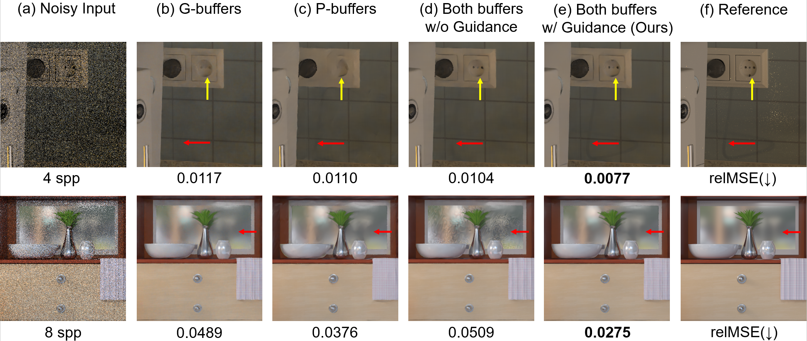

# Pixel-wise Guidance for Utilizing Auxiliary Features in Monte Carlo Denoising
## I3D2023, PACMCGIT
### [Project Page](https://sgvr.kaist.ac.kr/~kbhan/I3D23_GuideMCD/) | [Paper(Author's Ver.)](https://kaistackr-my.sharepoint.com/:b:/g/personal/qbhan_kaist_ac_kr/EcXsmcHJ1KdOkg1muPAHBT4BGAMfU7kEfg6itZ33tuH_8Q?e=SNUH4K) | [Interactive Viewer](https://sgvr.kaist.ac.kr/~kbhan/i3d23_guidemcd_supp/)
<br>Official PyTorch implementation.</br>
 [Kyu-Beom Han](https://qbhan.oopy.io/)<sup>1</sup>,
 Olivia G. Odenthal<sup>2</sup>,
 Woo-Jae Kim<sup>1</sup>,
 [Sung-eui Yoon](https://sgvr.kaist.ac.kr/~sungeui/)<sup>1</sup> <br>
KAIST, Repulic of Korea<sup>1</sup>  
University of Stuttgart, Germany<sup>2</sup>  



### Scene credits
- ["My Kitchen"](https://www.blendswap.com/blend/9528) by [tokabilitor](https://www.blendswap.com/profile/41638) under CC-0.
- ["Bath"](https://www.blendswap.com/blend/18595) by [Ndakasha](https://www.blendswap.com/profile/404844) under CC-0.

## Paper Summary

Our pixel-wise guidance framework enhances the per-pixel contribution of each type of auxiliary features (G-buffers and P-buffers[Cho et al. 2021]), achieving considerable test performance increase compared to baseline denoising models. 

Our code is tested on Ubuntu 18.04 with an Intel i9-10940X CPU with NVIDIA Geforce RTX 3090, RTX 2080ti, and Quadro RTX 8000 graphics cards.

## Quick Start

1. Clone the git repository and create a PyTorch Anaconda environment as below:
    ```
    conda create -n pytorch python=3.10
    activate pytorch
    pip install torch
    pip install h5py tensorboard tensorboardX  opencv-python kornia scipy pandas tqdm matplotlib visdom imageio scikit-image numpy pykeops
    ```
New: Our framework works on recent PyTorch version!
2. Go to torch_utils and follow the instructions to install per-pixel kernel function for PyTorch

3. Run the shell script in the directory 'scripts/' to train the model.


## Overview
1. Supporting State-of-the-art baselines: 
    - Image-space MC Denoising 
      - Kernel-predicting convolutional network (KPCN) [Bako et al. 2017]
      - Adversarial Monte Carlo Denoising (AdvMCD) [Xu et al. 2019]
    - Sample-space MC Denoising (TODO)
        - Neural Denoising with Layer Embeddings (NDLE) [Munkberg and Hasselgren 2020]
        - Sample-based Monte Carlo Denoising (SBMC) [Gharbi et al. 2019]

2. Repository Overview
   - train_kpcn.py         # Train KPCN with G- \& P- buffers
   - train_adv.py          # Train AdvMCD with G- \& P- buffers
   - train_lbmc.py (TODO)  # Train NDLE with G- \& P- buffers
   - train_sbmc.py (TODO)  # Train SBMC with G- \& P- buffers
   - train_ensemble.py     # Train Our Guidance Denoising Framework
   - test_models.py        # Test any model
     - support/            # Codes for baselines \& utilities
       - WCMC/             # Codes for reproducing KPCN & SBMC & WCMC 
       - AdvMCD/           # Codes for reproducing AdvMCD
       - NDLE/ (TODO)      # Codes for reproducing NDLE
     	- datasets.py      
     	- img_utils.py
     	- interfaces.py
     	- losses.py
     	- metrics.py
     	- networks.py
     	- utils.py
   	- scripts/             # Scripts to train models
   	- torch_utils          # Cuda implementation of per-pixel kernel for PyTorch [Munkberg and Hasselgren 2020]


## Dataset
Our dataset is about 2TB large. If you are interested in our work and happy to play with our dataset, please leave an git issue requesting the dataset.
We will provide a link you can download the whole dataset.


### Reference
- Bako, Steve, et al. "Kernel-predicting convolutional networks for denoising Monte Carlo renderings." ACM Trans. Graph. 36.4 (2017): 97-1.
- Gharbi, Michaël, et al. "Sample-based Monte Carlo denoising using a kernel-splatting network." ACM Transactions on Graphics (TOG) 38.4 (2019): 1-12.
- Munkberg, Jacob, and Jon Hasselgren. "Neural denoising with layer embeddings." Computer Graphics Forum. Vol. 39. No. 4. 2020.
- Cho, In-Young, Yuchi Huo, and Sung-Eui Yoon. "Weakly-supervised contrastive learning in path manifold for Monte Carlo image reconstruction." ACM Trans. Graph. 40.4 (2021): 38-1.